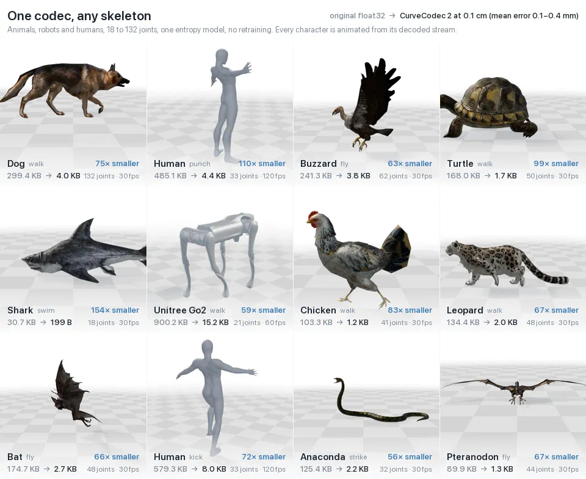
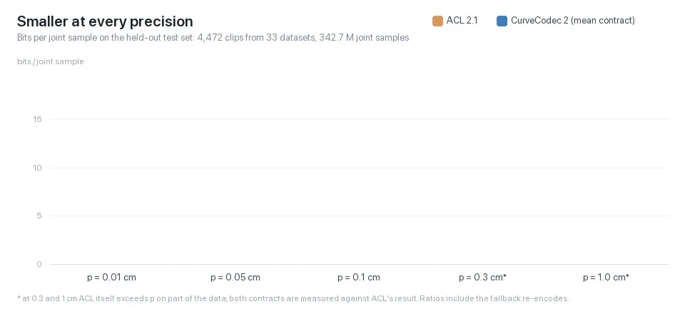
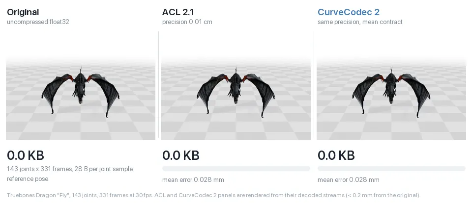

<h1 align="center">CurveCodec <sub><sup>v0.2.0</sup></sub></h1>

<p align="center"><b>Skeleton-agnostic animation compression with a learned entropy model</b></p>

<p align="center"><b>SIGGRAPH Asia 2026</b></p>

<p align="center">
  <a href="https://rubbly.cn/publications/curvecodec/"></a>
  <a href="https://playground.rubbly.cn/codec/"></a>
  <a href="https://doi.org/10.1145/3829340.3842192"></a>
</p>

<p align="center">
  <a href="https://rubbly.cn/">Mingyi Shi</a><sup>1</sup> ·
  <a href="https://scholar.google.com/citations?user=2ffzE68AAAAJ">Huancheng Lin</a><sup>1</sup> ·
  <a href="https://xuelin-chen.github.io/">Xuelin Chen</a><sup>2,*</sup> ·
  <a href="https://i.cs.hku.hk/~taku/">Taku Komura</a><sup>1,*</sup>
</p>

<p align="center"><sup>1</sup>The University of Hong Kong · <sup>2</sup>Adobe Research · <sup>*</sup>Co-corresponding authors</p>

<div align="center">
  
</div>

<p align="center"><sub>Original float32 clip → CurveCodec at 0.1 cm (mean error 0.1–0.4 mm). Across our held-out
test set, the average at this precision is about 100× smaller than float32.</sub></p>

---

## News

- **[2026-10-02]** CurveCodec v0.2.0: code, model weights and the train/test split are released. 
- **[2026-10-02]** The [live demo](https://playground.rubbly.cn/codec/) is online: upload a BVH and compare against ACL. 🎮


## Why study compression at first?

- **Motion data is highly redundant.** A clip stores every joint's local transform at every frame, yet a person
  performing an action rarely attends to how each joint gets from one place to the next: the trajectories are largely
  produced by a strong prior, the body itself. Spending more effort and computation on generating these curves does
  little for understanding behaviour or action.
- **Compression is a principled way to learn what matters.** Embodied intelligence works the same way: an agent
  decides what to do, and its body decides most of how. A model of motion should spend its capacity on the decisions,
  not on the kinematics the body already implies. Compression separates the two: what a codec must still send is the
  decision; what it can drop is the body.
- **We want a representation general enough to model the dynamics of motion.** If the body is only the prior, the
  representation should not be tied to one body. Hierarchical skeleton representations bake a topology into the data,
  so every rig needs its own model. CurveCodec: one model serves any rig, and transfers without retraining to a
  species it has never seen.

CurveCodec is built on these three answers.

## What the library does

| | |
|---|---|
| **Input** | Any skeleton, any rig: per-joint rotations and translations (BVH). One model for humans, hands, animals, robots and game rigs, with no per-rig training. |
| **Precision** | 0.01 to 1 cm, set per clip. Every decoded clip is verified against its error bound, and a clip that misses is re-encoded with tighter margins. |
| **Entropy model** | A 108 K-parameter causal transformer (870 KB). Its integer inference is bit-exact across platforms, and it changes only the bits, never the decoded motion. |
| **Footprint** | About 2 bits per joint sample at 0.1 cm. Our training corpus of about 900 h of motion fits in a few GB. |
| **Decode** | 2.1 s per million joint samples on one CPU core, or 0.76 s on four threads. An optional CUDA path is available. |
| **Training** | The codec dumps its own residual streams, so you can retrain the model on your data. The released model took about 1.5 h on one RTX 4090. |

## Compared with ACL

<p align="center">
  
</p>

On our held-out test set of about 4,500 clips (about 20 h), every clip keeps ACL's mean error at the same *p*,
with per-joint caps and an anti-pop guard. Each clip that misses this contract is counted with its fallback stream.
On that set, CurveCodec needs **0.37×** ACL's bytes at 0.01 cm, **0.27×** at 0.05 cm, **0.22×** at 0.1 cm, **0.14×**
at 0.3 cm and **0.07×** at 1 cm.

<p align="center">
  
</p>

The two codecs serve different goals, and CurveCodec is not a replacement for ACL. ACL is built for runtime: it is
stateless, keeps the clip compressed in memory and decompresses only the poses a frame needs, and samples any pose at
random with minimal memory traffic. CurveCodec corrects
its encoder with error feedback through forward kinematics. Its stream is entropy-coded and decoded once per clip. It
is meant for storing and streaming whole clips, and for asking what motion data really contains.

## Install

Python ≥ 3.9 with numpy, a C compiler (the bit-exact C fast paths compile on first use; without one, everything
runs in numpy), and CMake with a C++17 compiler to build the ACL reference tool.

```bash
git clone <this repo> curvecodec && cd curvecodec
pip install -e .                      # or: pip install -r requirements.txt
scripts/fetch_acl.sh                  # ACL 2.1 (develop 3ee5685) + rtm + sjson-cpp -> third_party/acl
cmake -S cpp -B cpp/build -DCMAKE_BUILD_TYPE=Release && cmake --build cpp/build -j
```

## Usage

```bash
curvecodec encode examples/cmu_27_07.bvh -o clip.cc2 --precision 0.01
curvecodec decode clip.cc2 -o clip.npz      # local transforms float32 [frames, joints, 7]: quat xyzw + translation (cm)
curvecodec info clip.cc2
```

`encode` runs ACL on the clip first (the error contract is defined against ACL's result at the same *p*), then encodes,
decodes, checks the contract, falls back to tighter margins if needed, and reports the size and the errors:

```
cmu_27_07.bvh: 31 joints x 1792 frames @ 120 fps, p = 0.01 cm, mean:G=10,C=1.05,T=1.02
  ACL        121,507 B  err mean 0.0027  max 0.0184 cm   (0.2 s)
  ours        54,058 B  err mean 0.0027  max 0.0263 cm   (5.3 s encode, 1.83 s decode)
  ratio 0.445 x ACL, contract met
```

Precisions are in centimetres. A rig whose longest rest-pose chain falls outside 40–300 units is rescaled to 110 cm;
pass `--scale <float>` when you know the unit (e.g. `--scale 100` for metres). Contract options:
`--contract mean:C=1.5` relaxes the per-joint cap to 1.5× (about 2–4 % smaller), and `--contract mean:F=0.05` suits
exported game animation with near-static tracks.

From Python:

```python
from curvecodec.acl import acl_clip
from curvecodec.cli import encode_clip
from curvecodec.codec import CurveCodec
from curvecodec.contract import Contract

clip = acl_clip("examples/cmu_27_07.bvh", [0.01])        # raw transforms + ACL's reference at 0.01 cm
codec = CurveCodec()
blob, margin, ok, *_ = encode_clip(codec, clip, 0.01, Contract.parse("mean"))   # with the fallback margins
poses = codec.decode(blob, clip.parents, clip.offsets, clip.fps)              # float32 [frames, joints, 7]
```

The blob, like ACL's compressed tracks, does not carry the skeleton (names, parents, rest offsets) or the frame rate;
the `.cc2` file stores them in a small JSON header.

**Evaluate on your own data** (ACL reference, contract check, bytes, errors, timings → `report.md` / `report.csv`):

```bash
python -m curvecodec.evaluate path/to/bvh_folder --precisions 0.01,0.1,1 --jobs 8 --out report
```

**Fast paths**: `python -m curvecodec.fast` shows which C paths are live. Set `CURVECODEC_NO_C=1` to use numpy only
(the reference), `CURVECODEC_TF_THREADS=4` to decode on 4 threads, and `CURVECODEC_TF_GPU=0` to run the transformer
step on CUDA device 0. All paths give identical bytes.

## Training the entropy model

The released weights are `curvecodec/data/model_int.npz` (fixed point, what the codec loads) and
`curvecodec/data/model_float.pt` (the float checkpoint it was exported from). The model is a causal transformer
with 2 blocks of width 64, 4 heads, a 128-position window and a 3-logistic mixture head. It sees 36 integer features of
each curve's own decoded past and never sees joint or skeleton identity. Training is three steps: dump the codec's
residual streams, pack them into a memory-mapped pool, and train and export. See [docs/TRAINING.md](docs/TRAINING.md).

```bash
python -m curvecodec.train.dump  data/bvh --out dumps --jobs 16
python -m curvecodec.train.pool  build dumps --out pool
python -m curvecodec.train.train --pool pool --out run --total-windows 40000000      # ~1.5 h on one RTX 4090
```

## Data

Our training corpus has about 900 hours of motion from public datasets. `curvecodec/data/split_v2.json.gz` is the
train/test split (`python -m curvecodec.split --side test` lists the test clips). [docs/DATA.md](docs/DATA.md) lists
every dataset with its download link. We do not redistribute motion data.


## Versions and citation

| version | | |
|---|---|---|
| **2.0** CurveCodec 2 (this repository) | **The same curve space, expressed with a more stable structure: comparable to ACL in both mean and worst-case error.** Closed-loop quantization and rate–distortion-selected keys are verified through the skeleton, and a small learned entropy model, whose integer inference is bit-exact across platforms, codes what remains. Every decoded clip is checked against its error contract. | [Project page](https://rubbly.cn/publications/curvecodec/) · paper soon |
| **1.0** CurveCodec, SIGGRAPH Asia 2026 | **In this work we first found that curve space is general enough: one learned model codes the joint curves of any skeleton.** It reconstructed each curve from sparse anchors with a learned prior and matched ACL's mean error, but its worst-case error was not stable enough and its encoding and decoding were less efficient, so version 2 replaces it. | [PDF](https://rubbly.cn/publications/curvecodec/files/curvecodec_siga2026.pdf) · [DOI](https://doi.org/10.1145/3829340.3842192) |

```bibtex
@article{shi2026codec2,
  title   = {CurveCodec 2: Skeleton-Agnostic Animation Compression
             with a Learned Entropy Model},
  author  = {Shi, Mingyi and Lin, Huancheng and Chen, Xuelin and Komura, Taku},
  year    = {2026}
}

@inproceedings{shi2026codec,
  title     = {Neural Codec for Skeletal Animation Compression},
  author    = {Shi, Mingyi and Lin, Huancheng and Chen, Xuelin and Komura, Taku},
  booktitle = {SIGGRAPH Asia 2026 Conference Papers (SA Conference Papers '26)},
  year      = {2026},
  month     = dec,
  address   = {Kuala Lumpur, Malaysia},
  publisher = {ACM},
  isbn      = {979-8-4007-2842-6},
  doi       = {10.1145/3829340.3842192}
}
```

## Acknowledgements

We thank Nicholas Frechette, the author of [ACL](https://github.com/nfrechette/acl), for detailed discussions of ACL's
design goals and technical details. We thank Jun Xing, Tianshu Zhang and
Zhixin Piao for the very early discussions on motion compression.

The characters in the images above are third-party assets: the animals come from the Truebones Zoo pack
(truebones.com), the human is the Geno character of the ZeroEGGS dataset (Ubisoft La Forge), and the robot is a
Unitree Go2 model (Unitree Robotics). The live demo also shows Sketchfab models under CC BY 4.0; they are credited in the
demo and on the [project page](https://rubbly.cn/publications/curvecodec/#ack), and listed in
[THIRD_PARTY_NOTICES.md](THIRD_PARTY_NOTICES.md).

## License

Free for academic and other non-commercial use; **commercial use requires a license from the authors** (contact:
myshi@cs.hku.hk, taku@hku.hk). See [LICENSE](LICENSE). The weights were trained on third-party datasets, some of which are
non-commercial only. ACL, RTM and sjson-cpp (fetched into `third_party/`) are MIT licensed; the example clip is from the
CMU Graphics Lab Motion Capture Database ([THIRD_PARTY_NOTICES.md](THIRD_PARTY_NOTICES.md)).
